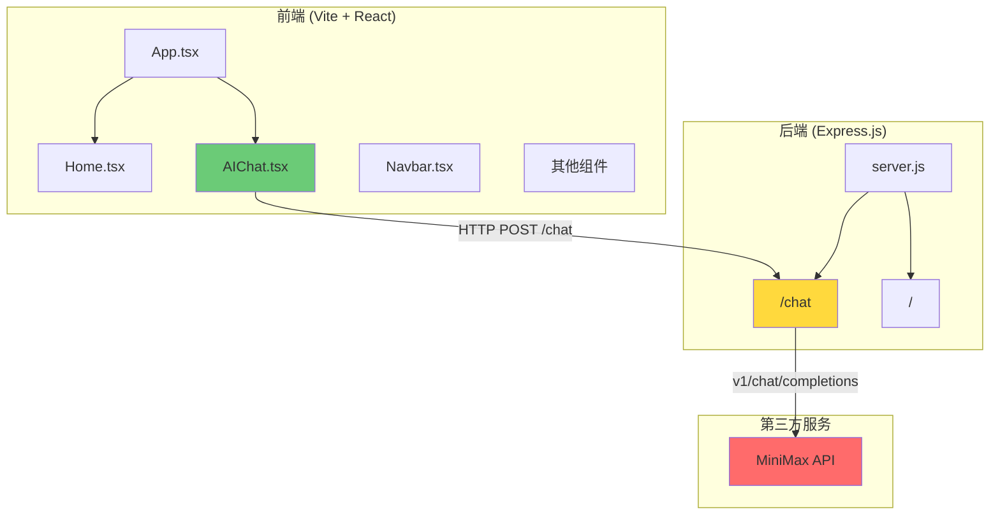

# 项目进度文档

> 更新时间: 2026-06-11

---

## 📌 今日完成内容 (2026-06-11)

**安全 / 后端加固**
- ⚠️ 发现并修复 API Key 泄露：`.env.example` 中真实 Key 字符串已替换为占位符 `your-key-here`（**用户必须去 MiniMax dashboard 轮换 Key**）
- CORS 收敛：`*` → 环境变量驱动的 origin 白名单（`ALLOWED_ORIGINS`），带 `Vary: Origin`，无 origin 请求不返回 CORS 头
- `POST /chat` 加固：
  - 8kb body 限制
  - 内存级 rate limit：30 req / 60s（按 IP），超限 429 + `Retry-After`
  - 接受可选 `history` 数组并严格校验（**显式拒绝 `role: 'system'` 防 prompt 注入**）
  - `AbortController` 20s 上游超时
  - 错误分类：超时 → 504 / 上游非 2xx → 502 / 网络异常 → 502 / 透传上游 429 + `Retry-After`
  - 日志改造：只记 `id / usage / finish_reason`，不再 `console.log` 完整对话内容
- Vite 代理端口与后端默认 PORT 对齐（统一 3001）
- 修复一个隐蔽 bug：`req.on('close', () => controller.abort())` 在 Express 5 / Node 20+ 下会在响应发送瞬间触发，把所有 in-flight 上游 fetch 砍成 504

**前端 AI 体验**
- `AbortController` per send：发新消息时取消旧请求，组件 unmount 时也取消
- 加载态：发送按钮 disabled + 消息列表底部"思考中…" dots 动画
- 错误分类：429 → "请求过于频繁" / 5xx → "服务暂时不可用" / 4xx → 后端 `error` 文案 / 网络 → "网络异常" / `AbortError` → 静默
- localStorage 持久化（key `my-blog-chat-history`）：刷新不丢
- 多轮上下文：把最近 20 条消息作为 `history` 发给后端，AI 真正能"记住"上文
- "清空对话" 按钮（一键清 state + localStorage + abort 进行中请求）

**架构 / 文档**
- 新增 `src/lib/apiBase.ts`：动态后端地址解析
  - `VITE_API_BASE_URL` 显式覆盖 > loopback host (localhost / 127.0.0.1 / 0.0.0.0 / ::1) → `http://<host>:3001` > 其它 → `https://tangsanyi-blog.onrender.com`
  - 浏览器地址栏用 localhost 时自动走本地后端，部署后自动走线上
- 新增 `CLAUDE.md`：项目结构、命令、架构说明、约定，给未来的 Claude Code 实例用

---

## 📌 昨日完成内容 (2026-06-10)

- 首页 Hero 组件开发
- 项目展示卡片布局
- 文章列表页开发
- 联系方式页面
- AI 助手页面接入 MiniMax-M3 模型
- 导航栏响应式设计
- 页脚组件
- 基础样式系统搭建
- 后端 Express 服务搭建
- `/chat` AI 对话接口实现
- CORS 跨域配置

---

## 📍 当前状态

### 前端 ✅ 基本完成（2026-06-11 加固）
- 首页、项目、文章、联系、AI助手页面全部完成
- 响应式布局适配移动端
- **AI 聊天支持多轮上下文、加载态、错误提示、刷新不丢历史**
- 动态后端地址：本地访问走 :3001，部署后走 Render

### 后端 ✅ 基本完成（2026-06-11 加固）
- Express 服务运行中
- AI 对话接口已对接 MiniMax-M3
- **CORS 收敛、限流、防注入、超时、日志收敛**
- 默认 PORT=3001，与 Vite 代理对齐

### 安全 / 卫生 ⚠️ 待用户执行
- **必须去 MiniMax dashboard 轮换 `MINIMAX_API_KEY`**（原 Key 已在 `.env.example` 中泄露过）
- 轮换后更新 Render 后端 env var

### 验证
- `npm run build` 通过（`tsc -b` + `vite build`）
- `npm run lint` 通过
- 后端冒烟全绿：健康 / 空 body → 400 / `system` role 注入 → 400 / history > 20 → 400 / OPTIONS 跨域 / 30 并发后第 31 个开始 429 / 真实 chat 2-3s 返回
- 前端在 `localhost:5173` 通过 Vite 代理 `http://localhost:5173/api/chat` 直连本地后端

---

## 🎯 下次开发任务

1. **流式响应 (SSE)** (P1)
   - 后端 `POST /chat` 支持 `stream: true`，转发 MiniMax 的 SSE
   - 前端用 `ReadableStream` + `TextDecoder` 增量渲染
   - 顺便把"打字机效果"补上

2. **AI system prompt** (P1)
   - 给 AI 一段静态 system context（自我介绍、博客内容、可用项目），让回答更贴用户
   - 后端新增 `system` 字段（不接 client 的 `system`，避免注入；只接后端写死的）

3. **Vite host: true** (P2)
   - 配 `server: { host: true }`，让 127.0.0.1 / 局域网 IP 也能开 dev server
   - 否则用户只能用 `localhost`（IPv6 ::1）

4. **重试机制** (P2)
   - 前端对 5xx / 502 错误做 1 次自动重试，间隔 1s
   - 用 `AbortController` 配合，手动取消时不重试

5. **测试** (P2)
   - 后端：vitest + supertest 跑 `/chat` 校验（必填 / 超长 / 注入 / 限流 / 错误码）
   - 前端：vitest + @testing-library/react 跑 AIChat（loading / abort / 持久化）

6. **历史清理** (P2，可选)
   - `git filter-repo` 清掉泄露 Key 的 git 历史

7. **监控 / 详细健康检查** (P2，承接 06-10)
   - `GET /api/health` 返回上游连通状态、进程 uptime、内存

---

## 1. 已完成功能

### 前端 (React + TypeScript + Vite)

| 模块 | 状态 | 说明 |
|------|------|------|
| 首页 Hero | ✅ 完成 | 展示个人介绍与 CTA 按钮 |
| 项目展示 | ✅ 完成 | 卡片式布局，支持内链/外链跳转 |
| 文章列表 | ✅ 完成 | 包含日期、阅读时间、摘要 |
| 联系方式 | ✅ 完成 | 邮箱、GitHub、Twitter 链接 |
| AI 助手页面 | ✅ 完成 | 已接入 MiniMax-M3 模型 |
| 导航栏 | ✅ 完成 | 滚动效果、移动端响应式菜单 |
| 页脚 | ✅ 完成 | 版权信息 |
| 样式系统 | ✅ 完成 | CSS 变量、设计令牌、响应式断点 |
| **AI 聊天多轮上下文** | ✅ 加固 | 把最近 20 条消息作为 `history` 传给后端，AI 能"记住"上文 |
| **AI 聊天加载态** | ✅ 加固 | 发送按钮 disabled + 消息列表底部"思考中…" dots 动画 |
| **AI 聊天错误分类** | ✅ 加固 | 429 / 5xx / 4xx / 网络 / Abort 五种错误各自提示文案 |
| **AI 聊天持久化** | ✅ 加固 | localStorage 缓存历史，刷新不丢；带"清空对话"按钮 |
| **动态后端地址** | ✅ 加固 | `src/lib/apiBase.ts`：loopback → :3001，否则 → Render，`VITE_API_BASE_URL` 覆盖 |

### 后端 (Express.js)

| 模块 | 状态 | 说明 |
|------|------|------|
| 健康检查 | ✅ 完成 | `GET /` 返回服务状态 |
| AI 对话接口 | ✅ 完成 | `POST /chat`接入 MiniMax |
| **CORS 白名单** | ✅ 加固 | 环境变量驱动的 origin 列表，默认 `localhost:5173` + Render；`Vary: Origin` |
| **限流** | ✅ 加固 | 内存级 30 req / 60s，超限 429 + `Retry-After` |
| **Body 限制** | ✅ 加固 | `express.json({ limit: '8kb' })` 防大包 |
| **多轮 history 校验** | ✅ 加固 | 拒绝 `role: 'system'` 防 prompt 注入；最多 20 条；单条 ≤ 4kb |
| **上游超时** | ✅ 加固 | `AbortController` 20s，超时 504 |
| **错误分类透传** | ✅ 加固 | 上游 4xx 透传 / 5xx 转 502 / 超时 504 / 网络 502 |
| **PII 安全日志** | ✅ 加固 | 只记 `id / usage / finish_reason`，不 `console.log` 完整对话内容 |

---

## 2. 后端接口

| 方法 | 路径 | 状态 | 说明 |
|------|------|------|------|
| GET | `/` | ✅ 已完成 | 健康检查接口 |
| POST | `/chat` | ✅ 已完成 | AI 对话接口，接入 MiniMax-M3 |

**待实现接口:**

| 方法 | 路径 | 优先级 | 说明 |
|------|------|--------|------|
| GET | `/api/health` | 低 | 详细健康检查 |

---

## 3. AI 接入进度 (MiniMax)

| 阶段 | 状态 | 说明 |
|------|------|------|
| 环境配置 | ✅ 已完成 | `.env` 文件已创建，API Key 已配置 |
| 后端 API | ✅ 已完成 | `/chat` 接口已实现 |
| 前端对接 | ✅ 已完成 | AIChat.tsx 调用真实 API |
| CORS | ✅ 已完成 | 已添加跨域支持 |
| 错误处理 | ✅ 已完成 | 网络错误时显示友好提示 |

**当前 AI 对接配置:**
- 接口: `https://api.minimax.chat/v1/chat/completions`
- 模型: `MiniMax-M3`
- 端口: 3000

---

## 4. 下一步工作

### 紧急 (P0)
无

### 重要 (P1)
1. 添加加载状态与打字机效果
2. 实现流式响应 (SSE)
3. 会话历史管理
4. 添加重试机制

### 优化 (P2)
5. 消息持久化 (数据库存储)
6. 敏感信息过滤
7. 限流保护
8. API 成本监控

---

## 5. 项目架构图



---

## 6. 技术栈

| 层级 | 技术 | 版本 |
|------|------|------|
| 前端框架 | React | 19.2.6 |
| 语言 | TypeScript | ~6.0.2 |
| 构建工具 | Vite | 8.0.12 |
| 路由 | React Router | 7.17.0 |
| 后端框架 | Express | 5.1.0 |
| AI 模型 | MiniMax-M3 | - |
| 环境变量 | dotenv | 已安装 |

---

## 7. 目录结构

```
my-blog/
├── index.html
├── package.json
├── vite.config.ts
├── tsconfig.json
├── eslint.config.js
├── CLAUDE.md                # 给 Claude Code 实例用的项目说明
├── backend/
│   ├── package.json
│   ├── server.js            # / 接口：CORS + 限流 + history 校验 + AbortController
│   ├── .env                 # API Key 配置（gitignored）
│   └── .env.example         # 占位符（真实 Key 视为泄露，必须轮换）
├── public/
│   ├── favicon.svg
│   └── icons.svg
├── src/
│   ├── main.tsx
│   ├── App.tsx
│   ├── index.css
│   ├── assets/
│   ├── components/
│   │   ├── Navbar.tsx
│   │   ├── Footer.tsx
│   │   ├── Hero.tsx
│   │   ├── Projects.tsx
│   │   ├── Articles.tsx
│   │   └── Contact.tsx
│   ├── pages/
│   │   ├── Home.tsx
│   │   └── AIChat.tsx       # 多轮 / 加载态 / abort / 持久化 / 错误分类
│   ├── lib/
│   │   └── apiBase.ts       # 动态后端地址解析（loopback vs 生产）
│   └── data/
│       └── content.ts       # 静态数据
└── plans/
    └── progress.md
