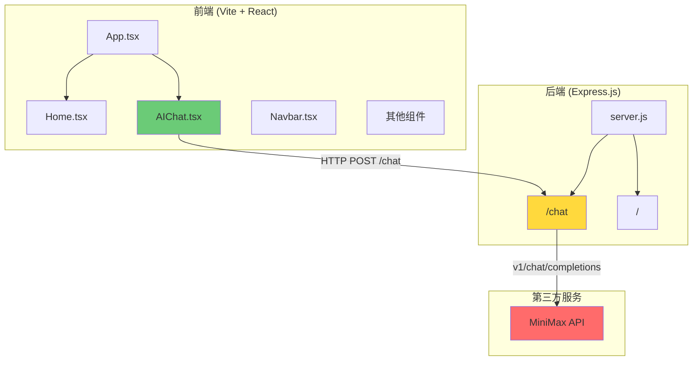

# 项目进度文档

> 更新时间: 2026-06-10

---

## 📌 今日完成内容 (2026-06-10)

- 首页 Hero 组件开发
- 项目展示卡片布局
- 文章列表页开发
- 联系方式页面
- AI 助手页面接入 MiniMax-M3 模型
- 导航栏响应式设计
- 页脚组件
- 基础样式系统搭建
- 后端 Express 服务搭建
- `/chat` AI 对话接口实现
- CORS 跨域配置

---

## 📍 当前状态

### 前端 ✅ 基本完成
- 首页、项目、文章、联系、AI助手页面全部完成
- 响应式布局适配移动端

### 后端 ✅ 基本完成
- Express 服务运行中
- AI 对话接口已对接 MiniMax-M3

---

## 🎯 下次开发任务

1. **AI 聊天增强** (P1)
   - 添加加载状态与打字机效果
   - 实现流式响应 (SSE)
   - 会话历史管理
   - 添加重试机制

2. **数据持久化** (P2)
   - 消息存储到数据库
   - 敏感信息过滤
   - 限流保护

3. **监控优化** (P2)
   - API 成本监控
   - 详细健康检查接口

---

## 1. 已完成功能

### 前端 (React + TypeScript + Vite)

| 模块 | 状态 | 说明 |
|------|------|------|
| 首页 Hero | ✅ 完成 | 展示个人介绍与 CTA 按钮 |
| 项目展示 | ✅ 完成 | 卡片式布局，支持内链/外链跳转 |
| 文章列表 | ✅ 完成 | 包含日期、阅读时间、摘要 |
| 联系方式 | ✅ 完成 | 邮箱、GitHub、Twitter 链接 |
| AI 助手页面 | ✅ 完成 | 已接入 MiniMax-M3 模型 |
| 导航栏 | ✅ 完成 | 滚动效果、移动端响应式菜单 |
| 页脚 | ✅ 完成 | 版权信息 |
| 样式系统 | ✅ 完成 | CSS 变量、设计令牌、响应式断点 |

### 后端 (Express.js)

| 模块 | 状态 | 说明 |
|------|------|------|
| 健康检查 | ✅ 完成 | `GET /` 返回服务状态 |
| AI 对话接口 | ✅ 完成 | `POST /chat`接入 MiniMax |

---

## 2. 后端接口

| 方法 | 路径 | 状态 | 说明 |
|------|------|------|------|
| GET | `/` | ✅ 已完成 | 健康检查接口 |
| POST | `/chat` | ✅ 已完成 | AI 对话接口，接入 MiniMax-M3 |

**待实现接口:**

| 方法 | 路径 | 优先级 | 说明 |
|------|------|--------|------|
| GET | `/api/health` | 低 | 详细健康检查 |

---

## 3. AI 接入进度 (MiniMax)

| 阶段 | 状态 | 说明 |
|------|------|------|
| 环境配置 | ✅ 已完成 | `.env` 文件已创建，API Key 已配置 |
| 后端 API | ✅ 已完成 | `/chat` 接口已实现 |
| 前端对接 | ✅ 已完成 | AIChat.tsx 调用真实 API |
| CORS | ✅ 已完成 | 已添加跨域支持 |
| 错误处理 | ✅ 已完成 | 网络错误时显示友好提示 |

**当前 AI 对接配置:**
- 接口: `https://api.minimax.chat/v1/chat/completions`
- 模型: `MiniMax-M3`
- 端口: 3000

---

## 4. 下一步工作

### 紧急 (P0)
无

### 重要 (P1)
1. 添加加载状态与打字机效果
2. 实现流式响应 (SSE)
3. 会话历史管理
4. 添加重试机制

### 优化 (P2)
5. 消息持久化 (数据库存储)
6. 敏感信息过滤
7. 限流保护
8. API 成本监控

---

## 5. 项目架构图



---

## 6. 技术栈

| 层级 | 技术 | 版本 |
|------|------|------|
| 前端框架 | React | 19.2.6 |
| 语言 | TypeScript | ~6.0.2 |
| 构建工具 | Vite | 8.0.12 |
| 路由 | React Router | 7.17.0 |
| 后端框架 | Express | 5.1.0 |
| AI 模型 | MiniMax-M3 | - |
| 环境变量 | dotenv | 已安装 |

---

## 7. 目录结构

```
my-blog/
├── index.html
├── package.json
├── vite.config.ts
├── tsconfig.json
├── eslint.config.js
├── backend/
│   ├── package.json
│   ├── server.js          # 已实现 /chat 接口
│   ├── .env                # API Key 配置
│   └── .env.example
├── public/
│   ├── favicon.svg
│   └── icons.svg
├── src/
│   ├── main.tsx
│   ├── App.tsx
│   ├── index.css
│   ├── assets/
│   ├── components/
│   │   ├── Navbar.tsx
│   │   ├── Footer.tsx
│   │   ├── Hero.tsx
│   │   ├── Projects.tsx
│   │   ├── Articles.tsx
│   │   └── Contact.tsx
│   ├── pages/
│   │   ├── Home.tsx
│   │   └── AIChat.tsx      # AI 对话页面
│   └── data/
│       └── content.ts      # 静态数据
└── plans/
    └── progress.md
