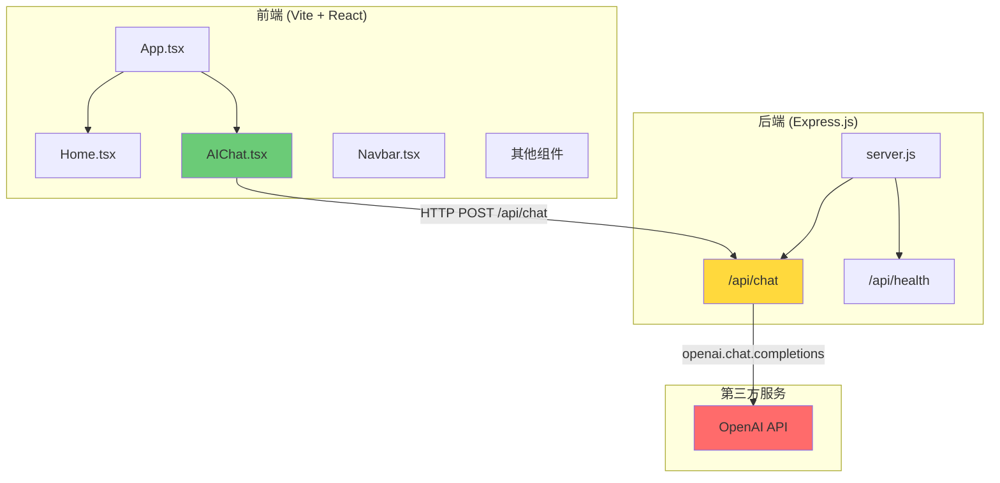

# 项目进度文档

> 更新时间: 2026-06-10

## 1. 已完成功能

### 前端 (React + TypeScript + Vite)

| 模块 | 状态 | 说明 |
|------|------|------|
| 首页 Hero | ✅ 完成 | 展示个人介绍与 CTA 按钮 |
| 项目展示 | ✅ 完成 | 卡片式布局，支持内链/外链跳转 |
| 文章列表 | ✅ 完成 | 包含日期、阅读时间、摘要 |
| 联系方式 | ✅ 完成 | 邮箱、GitHub、Twitter 链接 |
| AI 助手页面 | ✅ UI 完成 | 聊天界面已搭建，等待 API 对接 |
| 导航栏 | ✅ 完成 | 滚动效果、移动端响应式菜单 |
| 页脚 | ✅ 完成 | 版权信息 |
| 样式系统 | ✅ 完成 | CSS 变量、设计令牌、响应式断点 |

### 后端 (Express.js)

| 模块 | 状态 | 说明 |
|------|------|------|
| 健康检查 | ✅ 完成 | `GET /` 返回服务状态 |

---

## 2. 后端接口

| 方法 | 路径 | 状态 | 说明 |
|------|------|------|------|
| GET | `/` | ✅ 已完成 | 健康检查接口 |

**待实现接口:**

| 方法 | 路径 | 优先级 | 说明 |
|------|------|--------|------|
| POST | `/api/chat` | 高 | AI 对话接口，需接入 OpenAI |
| GET | `/api/health` | 低 | 详细健康检查 |

---

## 3. OpenAI 接入进度

| 阶段 | 状态 | 说明 |
|------|------|------|
| 环境配置 | ❌ 未开始 | 缺少 `.env` 配置文件 |
| SDK 安装 | ❌ 未开始 | 未安装 `openai` npm 包 |
| 后端 API | ❌ 未开始 | `/api/chat` 接口未创建 |
| 前端对接 | ❌ 未开始 | AIChat 组件使用硬编码假数据 |
| 错误处理 | ❌ 未开始 | 无网络错误、限流处理 |
| 流式响应 | ❌ 未开始 | 未实现 Server-Sent Events 或 WebSocket |

**当前 AIChat 组件使用的假数据:**
```typescript
const AI_REPLY = '我是AI助手'
```

---

## 4. 下一步工作

### 紧急 (P0)
1. **安装 OpenAI SDK** - `npm install openai`
2. **创建 .env 文件** - 配置 `OPENAI_API_KEY`
3. **实现 /api/chat 接口** - 后端调用 OpenAI API
4. **对接前端** - 将 AIChat.tsx 改为调用真实接口

### 重要 (P1)
5. 添加加载状态与打字机效果
6. 实现流式响应 (SSE)
7. 添加错误处理与重试机制
8. 会话历史管理

### 优化 (P2)
9. 消息持久化 (数据库存储)
10. 敏感信息过滤
11. 限流保护
12. API 成本监控

---

## 5. 项目架构图



---

## 6. 技术栈

| 层级 | 技术 | 版本 |
|------|------|------|
| 前端框架 | React | 19.2.6 |
| 语言 | TypeScript | ~6.0.2 |
| 构建工具 | Vite | 8.0.12 |
| 路由 | React Router | 7.17.0 |
| 后端框架 | Express | 5.1.0 |
| AI SDK | openai | 未安装 |

---

## 7. 目录结构

```
my-blog/
├── index.html
├── package.json
├── vite.config.ts
├── tsconfig.json
├── eslint.config.js
├── backend/
│   ├── package.json
│   └── server.js          # 当前仅健康检查
├── public/
│   ├── favicon.svg
│   └── icons.svg
├── src/
│   ├── main.tsx
│   ├── App.tsx
│   ├── index.css
│   ├── assets/
│   ├── components/
│   │   ├── Navbar.tsx
│   │   ├── Footer.tsx
│   │   ├── Hero.tsx
│   │   ├── Projects.tsx
│   │   ├── Articles.tsx
│   │   └── Contact.tsx
│   ├── pages/
│   │   ├── Home.tsx
│   │   └── AIChat.tsx      # AI 对话页面
│   └── data/
│       └── content.ts      # 静态数据
└── plans/
    └── progress.md
```
